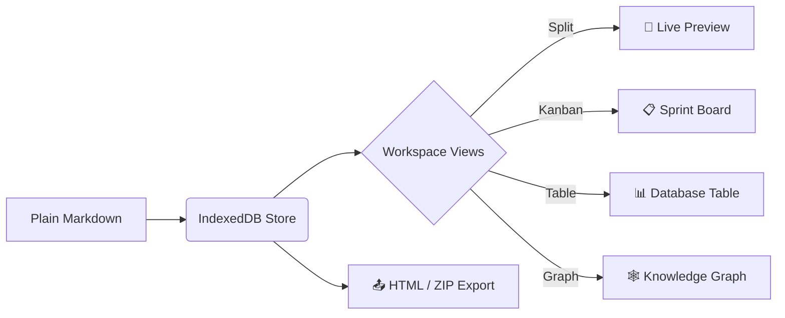

# 📝 MarkdownView

<p align="center">
  <strong>The open-source, privacy-first, Notion-style Markdown workspace.</strong><br>
  Built with Angular 22, Tailwind CSS 4, KaTeX scientific math, Mermaid.js diagrams, and native local filesystem sync.
</p>

<p align="center">
  <a href="https://github.com/Subhrangsu90/markdown-view/releases"></a>
  <a href="LICENSE"></a>
  <a href="https://angular.dev"></a>
  <a href="https://tailwindcss.com"></a>
  <a href="https://katex.org"></a>
  <a href="https://mermaid.js.org"></a>
  <a href="CONTRIBUTING.md"></a>
  <a href="#"></a>
</p>

---

## 🌟 Overview

**MarkdownView** bridges the gap between the structured ease of modern productivity suites (like Notion) and the uncompromised ownership and speed of raw Markdown editors (like Obsidian, MarkText, and Typora).

It runs **100% in your browser** with zero external trackers, telemetry, or server database lock-in. Your documents, history, and media assets are stored safely in the browser's native **IndexedDB** database with zero storage quotas, or synced directly to your physical hard drive using the **Web File System Access API**.

For an exhaustive technical manual and API reference, see [DOCUMENTATION.md](DOCUMENTATION.md).

---

## ✨ Superpowers & Highlights

### 🗄️ Native IndexedDB Storage Engine (Zero Quota Caps)
MarkdownView stores all notes, snapshot histories, user settings, and media assets directly in the browser's native **IndexedDB** (`markdown_view_db`). Unlike legacy `localStorage` (capped at 5MB), IndexedDB safely handles gigabytes of notes, historical revisions, and high-resolution assets with zero external dependencies.

### 🖼️ Smart Image Pasting & Clean Asset Pipeline
- **No Base64 Bloat in Markdown**: Paste (<kbd>Ctrl+V</kbd>) or drag-and-drop images directly into the editor. They are saved as binary `Blob` objects in IndexedDB and referenced cleanly as ``.
- **Live Preview Resolution**: Images render instantly via dynamic object URLs with automatic memory caching.
- **Export Portability**: When exporting to HTML or copying formatted text, images are automatically converted to inline Base64 data URIs on the fly.

### 💻 Syntax Highlighting & Copy Buttons (PrismJS)
Code blocks support 25+ programming languages (TypeScript, Rust, Python, Go, Java, C++, Bash, SQL, and more) with customized theme tokens, clean line styling, and an automated one-click copy button.

### 🔗 Obsidian-Style [[Wikilinks]] & Backlinks Explorer
- **Autocomplete [[Wikilinks]]**: Type `[[` anywhere in the editor to quickly link to any note in your workspace.
- **Backlinks Panel**: Discover every document across your vault that links back to your active note.

### 🕸️ Interactive Visual Knowledge Graph (<kbd>Ctrl+G</kbd>)
Visualize your workspace as a dynamic, interactive force-directed graph. Explore connections between documents, tags (`#tag`), and wikilinks. Click any node to navigate directly to it.

### 🗃️ Notion-Style Multi-Views & YAML Frontmatter
Add YAML metadata to your documents to power specialized workspace views:
- **Kanban Board View**: Organize cards into status columns (`Backlog`, `In Progress`, `Done`) with fluid drag-and-drop.
- **Database Table View**: Inspect, filter, and sort your vault by title, folder, status, and tags.
- **Document Editor View**: The classic split-view writing workspace.

### 🕒 Document Revision History ("Time Machine" <kbd>Ctrl+H</kbd>)
Inspect automatic incremental drafts as you write, view word and character diff summaries, and restore any previous version with a single click.

### 🔒 Client-Side AES-GCM Vault Encryption
Lock sensitive notes with client-side password encryption powered by Web Cryptography (SubtleCrypto AES-GCM with PBKDF2 key derivation). Notes cannot be viewed or decrypted without the passphrase.

### ⚡ Notion-Style Slash Commands (`/`) & Command Palette (<kbd>Ctrl+K</kbd>)
Summon headings, code blocks, tables, task lists, blockquotes, math formulas, and diagrams with a single `/` keystroke, or press <kbd>Ctrl+K</kbd> to execute commands across the workspace.

### 🔀 Synchronized Live Split-View
Work in raw Markdown on the left while watching pixel-perfect rendered output on the right. Scroll positions stay effortlessly synchronized in real time. Switch between **Edit**, **Split**, and **Preview** with instant hotkeys.

### 📐 Scientific Math via KaTeX ($\LaTeX$)
Render publication-grade mathematical equations with full $\LaTeX$ syntax support. Use inline expressions like $E = mc^2$ or full block equations:

$$
\int_{-\infty}^{\infty} e^{-x^2} dx = \sqrt{\pi}
$$

### 📊 Dynamic Mermaid.js Visual Diagrams
Generate flowcharts, sequence diagrams, state machines, entity relationship diagrams, and Gantt charts directly from plain text:



### 📤 Multi-Format Tailored Exports
- **Download Doc + Images (.zip)**: Bundles the active note and its companion `assets/` folder (Obsidian format).
- **Standalone .md (Embedded Images)**: Inlines local images as Base64 for a single self-contained Markdown file.
- **Standalone HTML (.html)**: Self-contained file with embedded styles, KaTeX math, PrismJS colors, offline copy scripts, and Base64 images.
- **Copy Formatted (with Images)**: Rich HTML clipboard copy ready to paste into Google Docs, Word, or Slack.
- **Print to PDF**: Clean print stylesheet optimized for document printing.
- **Workspace ZIP Archive**: Complete backup of all documents and folders.

### 📁 Native Local Hard Drive Sync
MarkdownView leverages the **Web File System Access API**. Choose any folder on your machine (e.g. your Obsidian vault or GitHub docs directory) to auto-save documents and companion `assets/` directly to disk.

### 🧘 Distraction-Free Focus (Zen) Mode
Enter full-screen zen mode (`F11` or shortcut button) to eliminate chrome and sidebars for an immersive writing experience.

### 📚 Pre-Built Starter Templates
Choose from high-utility starter templates:
- **Welcome to MarkdownView Guide**
- **MarkdownView Technical & Architecture Manual**
- **System Architecture RFC Spec** (with Mermaid sequence diagrams)
- **Product Roadmap & Sprint Board** (with task checklists)
- **Mathematical Physics Lab Notes** (with KaTeX proofs)
- **Executive Team Meeting Sync** (with action item assignments)
- **Open Source Project README**

### 🌓 Adaptive Modern Themes
Switch seamlessly between dark and light modes. Every token is carefully tuned with HSL CSS variables for maximum contrast and zero eye fatigue.

---

## 🏗️ Architecture & Monorepo Structure

MarkdownView is built with modern Angular (Signals, Standalone Components, Control Flow syntax) in a clean monorepo architecture:

```
markdown-view/
├── projects/
│   └── md-core/                     # Reusable Core Markdown Library
│       ├── src/lib/
│       │   ├── components/          # UI Primitives (preview, split-view, toolbar, TOC)
│       │   ├── icons/               # Centralized SVG Icon Registry & MdIcon component
│       │   ├── models/              # Document types, starter templates, interfaces
│       │   ├── services/            # DocumentStore (Signals), LocalDirectoryService, Exporters
│       │   └── styles/              # Global theme tokens, variables, & typography
│       └── public-api.ts            # Public API exports for npm publishing
├── src/
│   └── app/                         # Desktop-Grade SPA Application
│       └── features/editor/         # Editor view, sidebar, slash menu, search & replace
├── .github/                         # Workflows, issue templates, PR template
├── README.md
├── CONTRIBUTING.md
├── CODE_OF_CONDUCT.md
└── LICENSE                          # MIT License
```

---

## 🚀 Quick Start

### Prerequisites
- [Node.js](https://nodejs.org/) v20.x or later (LTS recommended)
- [npm](https://www.npmjs.com/) v10.x or later

### Installation

1. **Clone the repository:**
   ```bash
   git clone https://github.com/Subhrangsu90/markdown-view.git
   cd markdown-view
   ```

2. **Install dependencies:**
   ```bash
   npm install
   ```

3. **Start the local development server:**
   ```bash
   npm start
   # or
   ng serve
   ```

4. **Open in your browser:**
   Open `http://localhost:4200/` and start writing!

---

## 💻 Available Scripts

| Command | Purpose |
|:--------|:--------|
| `npm start` | Runs the Angular development server on `http://localhost:4200` |
| `npm run build` | Compiles the production application bundle into `dist/` |
| `npm test` | Runs unit tests using the [Vitest](https://vitest.dev/) test runner |
| `npm run watch` | Builds library and app in watch mode for development |
| `npx ng build md-core` | Builds only the reusable `md-core` library package |

---

## ⌨️ Keyboard Shortcuts Reference

| Shortcut | Description |
|:---------|:------------|
| <kbd>Ctrl</kbd> + <kbd>E</kbd> / <kbd>Cmd</kbd> + <kbd>E</kbd> | Switch to **Edit Mode** |
| <kbd>Ctrl</kbd> + <kbd>P</kbd> / <kbd>Cmd</kbd> + <kbd>P</kbd> | Switch to **Preview Mode** |
| <kbd>Ctrl</kbd> + <kbd>\</kbd> / <kbd>Cmd</kbd> + <kbd>\</kbd> | Switch to **Split View Mode** |
| <kbd>Ctrl</kbd> + <kbd>B</kbd> / <kbd>Cmd</kbd> + <kbd>B</kbd> | Toggle Navigation Sidebar |
| <kbd>Ctrl</kbd> + <kbd>F</kbd> / <kbd>Cmd</kbd> + <kbd>F</kbd> | Open Find & Replace Bar |
| <kbd>Ctrl</kbd> + <kbd>O</kbd> / <kbd>Cmd</kbd> + <kbd>O</kbd> | Open Document Outline (Table of Contents) |
| <kbd>Ctrl</kbd> + <kbd>J</kbd> / <kbd>Cmd</kbd> + <kbd>J</kbd> | Open **Template Library** |
| <kbd>F11</kbd> | Toggle **Distraction-Free Focus (Zen) Mode** |
| <kbd>Esc</kbd> | Exit Focus Mode / Close active modal or dropdown |
| <kbd>Ctrl</kbd> + <kbd>/</kbd> / <kbd>Cmd</kbd> + <kbd>/</kbd> | Open Keyboard Shortcuts & Help Modal |
| <kbd>/</kbd> (on blank line) | Open Notion-Style Slash Command Menu |

---

## 🤝 Contributing

We welcome contributions of all kinds! Please review our [Contributing Guide](CONTRIBUTING.md) and [Code of Conduct](CODE_OF_CONDUCT.md) before submitting pull requests.

1. Fork the repo & create your feature branch: `git checkout -b feat/my-cool-feature`
2. Commit your changes: `git commit -m 'feat(editor): add my cool feature'`
3. Push to your branch: `git push origin feat/my-cool-feature`
4. Open a Pull Request!

---

## 🛡️ Privacy Commitment

MarkdownView operates on a strict **zero telemetry, zero tracking, zero external database** policy:
- No remote analytics or trackers are loaded.
- All notes persist inside your browser's private indexed/local storage.
- When using folder sync, files are read and written strictly through the browser's native sandboxed File System Access API.

---

## 📄 License

This project is open-source software licensed under the [MIT License](LICENSE).

---

<p align="center">
  Crafted with ❤️ by Subhrangsu and the open-source community.
</p>
